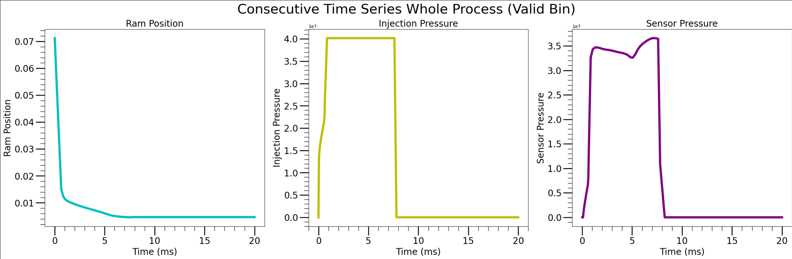
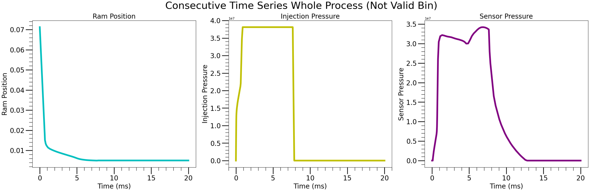
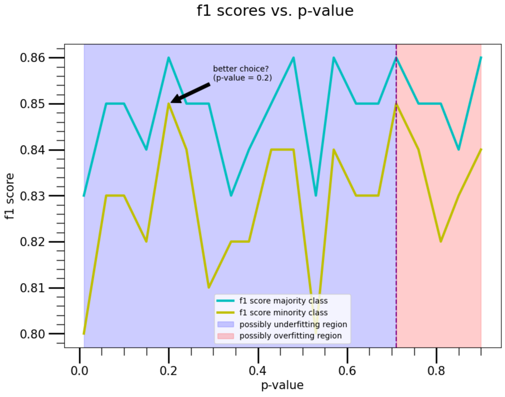

# Partial Report project AI Applications: AI4IM (simulated data Y2 labels)

###### Student: Alfredo Vargas
###### R-number: r0835034

## Problem description

- Simulated Data of bin productions using Injection Moulding (Datapoints generated using Matlab)

### Dataset

- 1542 datapoints
- The datapoints contains three time series:
    1. Ram position vs time
    2. Injection Pressure vs time
    3. Sensor Pressure vs time

#### Data Exploration

- A valid bin multivariate time series process looks as follows:


- A not valid bin multivariate time series process looks as follows:


- Although sometimes we see a differences between these two random selected points for valid and not valid. We cannot conclude that there is deterministic method to determine when a bin will have a defect or not. However, we see that there could be enough information to make statistical analysis, therefore ML methods can be suitable.

### Labels:
- $Y_2$ $\in \mathbb{B}^{1542\times1}$, where $B={\{0,1\}}$ with $1$ representing a valid bin and $0$ a not valid bin.
- Description:

| Feature    | Dimension    | Data Type    |
|---------------- | --------------- | --------------- |
| ramposition    | 1542    | float    |
| ramposition_time    | 1542    | float    |
| injection_pressure   | 1542   | float   |
| injection_pressure_time   | 1542   | float   |
| sensor_pressure   | 1542   | float |
| sensor_pressure_time   | 1542   | float   |

- Imbalanced dataset:
    - The number of valid bins is $1080$ which correspond to the $70.04$ %
    - The number of not valid bins is $462$ which correspond to the $29.96$ %

#### Goal:

- Selecting the metric:

    - It is important to note that in a time series problem the mean accuracy cannot be considered as a good indicator for the performance. The reason for this is that the datapoins are time correlated and are therefore not independent from each other. However, after feature engineering which allows to represent the time series problem as a classification problem with tabular data, then we at this point can consider the mean accuracy as good indicator for the performance of the algorithm **ONLY** when we have a balanced dataset!. We address this imbalance issue by incrementing the minority class and using the **f1 score** to estimate better the true positives, true negatives, false positives and false negatives.

- Get at least a performance of 80% for the f1-score for both the majority class (valid bins) and minority class (not valid bins).

- From the economical point of view of a molding injection process, not detecting the faulty pieces (**false positives**) is the one that have the most negatively impact, _both economically and to the environment_:
    - Economically, because we are not able to efficiently use the material and resources that require to follow the quality standard of the bins. This is a condition before one is able to commercialize any product.
    - Environmentally, because we waste `plastic` material whose usage we are already trying to minimize.

### Data preprocessing & Feature engineering

#### Feature engineering with `Helper.py`:

1. `series2features` function from `Helper.py` file, for each time-series generates $22$ new engineered features. 
2. After that concatenated features into one dataset matrix with dimension $66$ features plus $1$ label $Y_2$.

#### Feature engineering with `tsfresh`:

1. First trim the values **before** implementing feature engineering.
2. Concatenate the time series before implementing feature engineering with `tfresh` to incorporate the effects of a multivariate time series problem.
3. Select the most relevant features by specifying a `p-value` (This parameter was optimized!)

#### Data cleaning steps:

- Many of the engineered features have $0$ constant values which after normalization become`NaN` values which are dropped.
- Some features have a constant value which can be dropped as they not contribute when one deals with some ML methods such a decision trees. However, we could keep it for its use when using other ML methods.
- To drop the features we use:

```python
full_data_df.dropna(axis=1).describe()  # we drop along the columns axis=1 (column)
```

#### Pre-processing steps:

- Normalization done as follows: (standardization)

```python
cols_to_norm = [i for i in range(0, 66)]  # we exclude the labels
full_data_df[cols_to_norm] = full_data_df[cols_to_norm].apply(lambda x: (x - x.mean()) / x.std())
full_data_df.head()
```

#### Data splits, tried the following:

1. Split 80% for train and 20% for test. A sort of training \"cross-validation\" can be considered intrinsically incorporated when using Random Forest with a number of estimator larger than one (the default is $100$). To split the data we used:

```python
from sklearn.model_selection import train_test_split
```

2. $p-value$ tuning to determine how many features must be kept in order to obtain the best results (**f1 scores**).

3. TODO: explore validation splits when using other ML methods.


### Selecting the Machine Learning Model

#### Methods

-  Because were dealing with a classification problem but not a regression, we need to consider models that allows to classify.
- Let's start with:
    1. Decision trees & Ensembles (specifically RandomForest)
    2. kNN
    3. Neural Networks

1. Random Forest Classifier

3. kNN
    - TODO

3. Neural Networks
    - TODO

### Results

### Performance Table



| Metric \ Model    | Random forest from Helper FE   | Random forest from tsfresh FE (pv=0.68)    | KNN from tsfresh    | NN from tsfresh   |
|---------------- | --------------- | --------------- | --------------- | --------------- |
| Precision for not valid class    | 0.79    | 0.84    | Item4.1    | Item5.1   |
| Precision for the valid class   | 0.81   | 0.82   | Item4.2   | Item5.2   |
| Recall valid for not valid class    | 0.81    | 0.81    | Item4.1    | Item5.1   |
| Recall for the valid class   | 0.79   | 0.84   | Item4.2   | Item5.2   |
| F1-score for not valid class    | 0.80    | 0.82    | Item4.1    | Item5.1   |
| F1-score for the valid class   | 0.80   | 0.83   | Item4.2   | Item5.2   |


### Conclusions

#### Data Exploration and Pre Analysis

- From the figures, we observe that potentially one has the opportunity to differentiate the bin classes valid and not valid by using the `Helper.py` module and feature enginnered dataset.
- From the new engineered dataset we observer that we will require some preprocessing. More specifically we will create in what follows a pipeline that will perform the following:
    - Standarization
    - Removal of NaN values
    - Address of Imbalance Issue (here we will use the `imblearn.over_sampling` and from it the `SMOTE` function):
    ```python
    from imblearn.over_sampling import SMOTE
    ```

- So far we have a good `f1-score` for both the minority and majority classes with values above $80$%.
- We can clearly identified two regions when feature engineering one related to the under fitting region when `p-values` when using the `tfresh`. One region corresponds to the under-fitting region ($p-value < 0.48$), meaning we have less features (52% or more are considered rare features and therefore ignored). The other region corresponds to the over-fitting region with $p-value > 0.48$ (52% or less are considered rare features and therefore ignored.)

- TODO:
    - Obtain optimal `p-values` when using other ML methods.


### Bibliography

- Oversampling technique `SMOTE` original paper:
    - https://arxiv.org/abs/1106.1813
