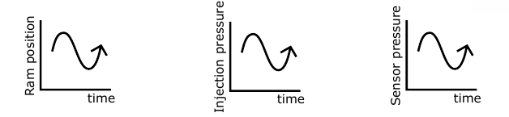

# General Objectives:
- Lower rejection rate, decrease cost, decrease waste
- Decrease need for manual check of every product
- Better quality control
- Give more insights into process using after-modelling XAI

# AI Objectives:
- Fault detection and classifications
- Quality prediction
- Predictive intervention
- XAI for more insight

# Stages

1. Closing the mould.
2. Inject the material.
3. Pressing the material.
4. Cool down the product in the mould.
5. Open the mould.
6. Eject the product.

# What can go wrong?

## Short Shot

- Molten plastic does not fully occupy the mould cavities.
  - Possible causes:
    1. Not enough inject material
    2. Not enough pressure
    3. Defect mould

## Warping

- Uneven shrinkage in the different parts of the product.
  - Possible causes:
    1. Not enough time to cool down the material.
    2. Gravity effects on the mould cooling.
    3. Defect mould.

## Flash

- Molten plastic escapes from the mould cavity
  - Possible causes:
    1. Wrong screwing of the mould.
    2. Wrong closing the mould.
    3. Defect mould

# Detection of defects
```dot
digraph {
    rankdir=LR
    "Weighting product" -> "Short shot"
    "Weighting product" -> "Flash"
    "Weighting product" -> "Short shot and Flash"
    "Measuring product" -> "Warping"
    "Measuring product" -> "Flash"
    "Measuring product" -> "Warping and Flash"
}
`````

# Data
  1. Ram position over time
  2. Pressure on injection over time
  3. Pressure in a sensor in the mould over time
  
  - Every product is 1 datapoint, containing 3 time series
  - Transfer Learning, we first train a model on simulated data. (Using Autodesk Moldflow)
  - Then retrain on a limited real dataset

# First Use Case
- Generate **simulated data** using Autodesk Moldflow
- Data for 1692 runs (products)
- Labels:
  - Box opening
  - Flatness of 5 sides
  - Weight
  - Valid/Non-valid

# Evaluation criteria
- Feature engineering
- Hyperparameter tuning
- How you detected & avoided overfitting
- Method selection
- Appropriate performance criteria used?
- Result on independent test set
- ...

# How to Start
1. Determine goals, metrics and target value for the metric
2. Establish a working end-to-end pipeline asap
3. Determine bottlenecks in performance & diagnose. Repeatedly make incremental changes based on specific findings.

